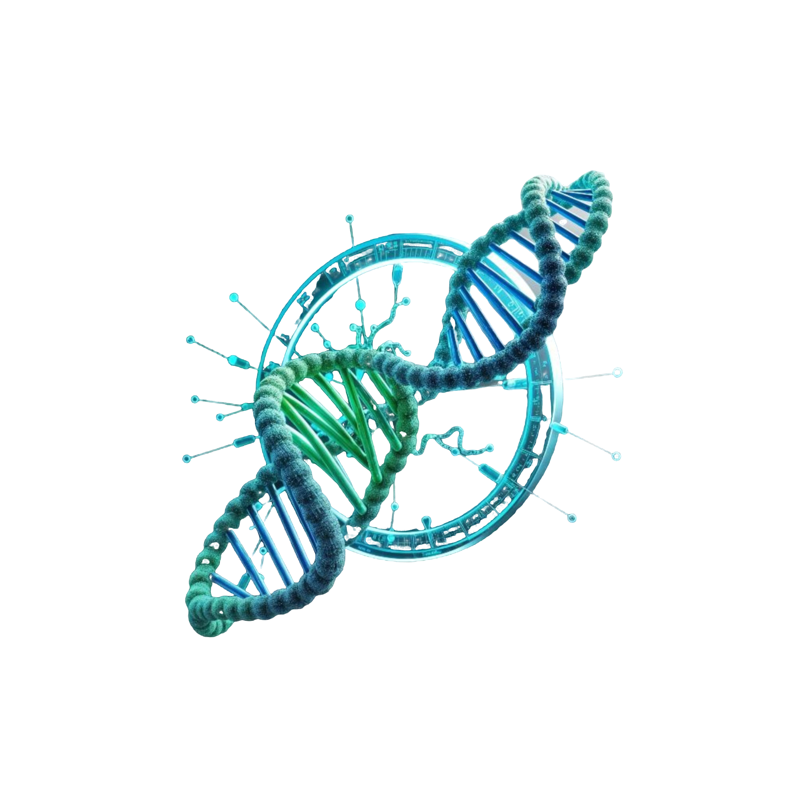

<figure>
  
</figure>

## Bio Dataset Manager: easily encode biological sequences into tensors

<hr>

[](https://codecov.io/gh/tacclab/bio_dataset_manager) 
[](https://pypi.org/project/bio_dataset_manager/)
<br>
[](https://tacclab.org)<br> 
[](https://github.com/tacclab/bio_dataset_manager/blob/main/LICENSE)<br>

## Authors:
<hr>
   - Fabio Bove | fabio.bove.dr@gmail.com<br> 
   - Eugenio Bertolini |  <br> 

---

## What is it?
Bio Data Manager is a Python project designed for managing and processing bio-sequence data, including DNA, proteins, and SMILES strings. This tool facilitates the encoding of these sequences into tensors, which can then be used for AI computations and complex model implementations.

---

## Project Structure
- `bio_data_manager/`: Contains core modules for bioinformatics sequence processing and management.
- `bio_sequences/`: Handles various operations related to biological sequences such as DNA and protein.

---

## Installation
1. Install it as a library
   - Using `CPU`:
      ```bash
      pip install bio-dataset-manager
      ```
   - Using `CUDA`:
      ```bash
      pip install bio-dataset-manager[cuda] -f https://download.pytorch.org/whl/torch_stable.html
      ```
     
---

## Usage
Examples of the code can be found in the `examples` folder.
1. import the modules
```python
import torch
from bio_dataset_manager.bio_dataloader import BioDataloader
from bio_dataset_manager.bio_dataset import BioDataset
from bio_sequences.dna_sequence import DnaSequence
```
2. create the dataset and dataloader
```python
dataset = BioDataset(
        dataset_folder="path/to/dataset",
        sequences_limit=10,
        randomize_choice=True,
        pad_same_len=False,
        window_size=1,
        sequence_info=DnaSequence(),
        sequences=None,
    )

dataloader = BioDataloader(
        dataset=dataset,
        batch_size=5,
        shuffle=True,
        collate_fn=dataset.collate_fn,
        split_ratio=0.5,
        use_gpu=True if torch.cuda.is_available() else False
    )
```
3. training loop example
```python
epochs = 5
for epoch in range(epochs):
    with tqdm(total=len(dataloader.training_dataloader), desc=f"Epoch {epoch + 1}/{epochs}", unit="batch") as pbar:
        for batch in dataloader.training_dataloader:
            y_real, lengths = dataloader.process_batch(batch)
            time.sleep(0.1)
            pbar.update(1)
            pbar.set_postfix(
                loss_gen=f"0.0",
                loss_dis=f"0.0"
            )
    pbar.refresh()
```

<hr>

## Contributing
Feel free to submit issues or pull requests if you'd like to contribute to this project.

<hr>

## License
[](https://github.com/tacclab/bio_dataset_manager/blob/main/LICENSE)<br>


