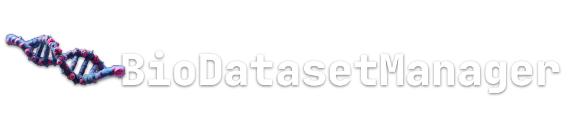

## Bio Data Manager
<figure>
  

</figure>

[](https://codecov.io/gh/tacclab/bio_dataset_manager) 
[](https://numfocus.org) 
[](https://github.com/tacclab/bio_dataset_manager/blob/main/LICENSE)

© Authors:<br>
   - Fabio Bove | fabio.bove.dr@gmail.com<br> 
   - Eugenio Bertolini |  <br> 
<hr>
Bio Data Manager is a Python project designed for managing and processing bio-sequence data, including DNA, proteins, and SMILES strings. This tool facilitates the encoding of these sequences into tensors, which can then be used for AI computations and complex model implementations.

## Project Structure
- `bio_data_manager/`: Contains core modules for bioinformatics sequence processing and management.
- `bio_sequences/`: Handles various operations related to biological sequences such as DNA and protein.


## Usage
1. Install it as a library
   - Using CPU:
      ```bash
      pip install git+ssh://git@github.com/tacclab/bio_data_manager.git@0.0.1
      ```
   - Using CUDA:
      ```bash
      pip install git+ssh://git@github.com/tacclab/bio_data_manager.git@0.0.1[cuda] -f https://download.pytorch.org/whl/torch_stable.html
      ```

2. Examples of the code can be found in the `usage_examples.py` file.

## Contributing
Feel free to submit issues or pull requests if you'd like to contribute to this project.

## License
This project is licensed under the MIT License.
